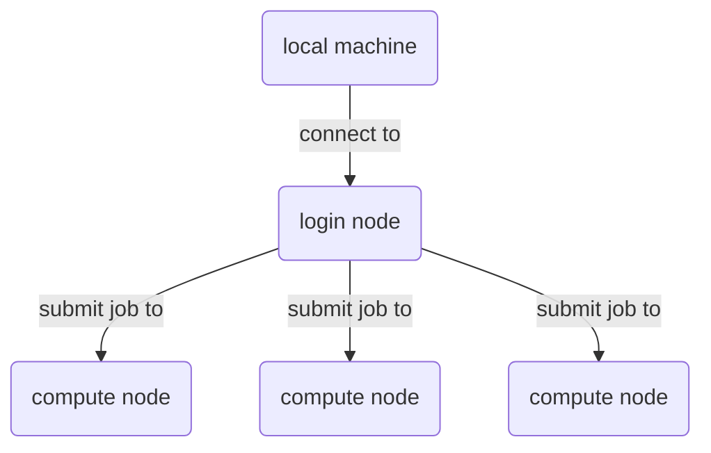

# Setup VASP with Intel OneAPI

Contributor: [github-young](https://github.com/github-young)

[typst-link](https://typst.app/project/w20ceNirrdGsq7B8rGdc6g)

## Get familiar with HPC3

**account setup**: Get the access to HPC3 via ITSC account. See [HPC3-website](https://itsc.hkust.edu.hk/services/academic-teaching-support/high-performance-computing/hpc3-cluster).

HPC3 terms

* `local machine`: your own computer.
* `computing`: run specific program which will cost a lot of resources, say, VASP.
* `login node`: the environment you will use after connecting to HPC3 with `ssh` from local machine. #myWarning("Never do heavy jobs on login node! That will affect other users.")
* `compute node`: the environment(s) for the computing. For HPC3 at HKUST, there are three compute node available: `cpu-share`, `gpu-share`, and `himem-share`.
* `job`: describe the computing task specificcally running on compute node. Users submit jobs from login node to compute node.
* `slurm`: a toolset for the job submitting, controlling, etc.

From users' perspective the system network is like:



## Helpful resources

* [GitHub notes to HPC3@HKUST](https://github.com/husisy/hkust-hpc-note/tree/master/hpc3)
* [User manual of HPC@PKU, introducing `slurm`](https://hpc.pku.edu.cn/_book/guide/slurm/sbatch.html)
* [slurm documentation](https://slurm.schedmd.com/documentation.html)

## Get files ready

```sh
mkdir -p ~/Downloads
cd ~/Downloads
```

### Intel OneAPI `basekit` and `hpckit`

Download these two `.sh` files from Intel website:

* [`l_BaseKit_p_2024.1.0.596_offline.sh`](https://www.intel.com/content/www/us/en/developer/tools/oneapi/base-toolkit-download.html?operatingsystem=linux&distributions=offline)
* [`l_HPCKit_p_2024.1.0.560_offline.sh`](https://www.intel.com/content/www/us/en/developer/tools/oneapi/hpc-toolkit-download.html?operatingsystem=linux&distributions=offline)

### VASP installation package

Use `sftp`, or other tools to upload the tarball `vasp.6.4.3.tgz` to HPC3.

## Installation

Before installation, you need to connect to the compute node because the compilation on login node can cause it over-occupied.

```sh
salloc -p cpu-share -N1 -n1
```

You will get a `JOBID` from the output; here it is `1225660`.

```text
salloc: Pending job allocation 1225660
salloc: job 1225660 queued and waiting for resources
salloc: job 1225660 has been allocated resources
salloc: Granted job allocation 1225660
```

Then you can connect to the allocated compute node by running this job with the corresponding `jobid`:

```sh
srun --jobid=1225660 --pty bash
```

After executing this command, you have entered the compute node. You can verify this by the `hostname` command, and you will get something like `hhnode-ib-89`. The hostname for login node is `login-0`. This is always a good method to distinguish which environment you are in.

### Intel OneAPI kits

1. Follow [this note](https://www.intel.com/content/www/us/en/docs/oneapi/installation-guide-linux/2024-1/install-with-command-line.html) and install both `basekit` and `hpckit`.

    The default installation location should be in the user home directory: `~/intel` or `${HOME}/intel` (they are the same).

2. Go to the installation location and setup modules:

    ```sh
    cd ${HOME}/intel/oneapi
    source setvars.sh
    ./modulefiles-setup.sh
    ```

This script should generate a module path at: `${HOME}/modulefiles`.

### Module setup

Unload and load several modules.

```sh
module load gnu8
module use "${HOME}/modulefiles"
module unload openmpi3
module load tbb
module load ccl
module load compiler-rt
module load oclfpga
module load compiler ifort intel_ippcp_intel64 mkl mpi
module load advisor dal debugger dev-utilities dnnl dpct dpl
module avail
```

You should see the output like this:

```text
Loading 2024.1 version modulefiles

--------------------------- /home/<ITSC>/modulefiles ----------------------------
   advisor/latest                          dpl/2022.5                  (L,D)
   advisor/2024.1                 (L,D)    ifort/latest
   ccl/latest                              ifort/2024.1.0              (L,D)
   ccl/2021.12.0                  (L,D)    ifort32/latest
   compiler-intel-llvm/latest              ifort32/2024.1.0            (D)
   compiler-intel-llvm/2024.1.0   (D)      intel_ipp_ia32/latest
   compiler-intel-llvm32/latest            intel_ipp_ia32/2021.11      (D)
   compiler-intel-llvm32/2024.1.0 (D)      intel_ipp_intel64/latest
   compiler-rt/latest                      intel_ipp_intel64/2021.11   (D)
   compiler-rt/2024.1.0           (L,D)    intel_ippcp_ia32/latest
   compiler-rt32/latest                    intel_ippcp_ia32/2021.11    (D)
   compiler-rt32/2024.1.0         (D)      intel_ippcp_intel64/latest
   compiler/latest                         intel_ippcp_intel64/2021.11 (L,D)
   compiler/2024.1.0              (L,D)    mkl/latest
   compiler32/latest                       mkl/2024.1                  (L,D)
   compiler32/2024.1.0            (D)      mkl32/latest
   dal/latest                              mkl32/2024.1                (D)
   dal/2024.0.0                   (L,D)    mpi/latest
   debugger/latest                         mpi/2021.12                 (L,D)
   debugger/2024.1.0              (L,D)    oclfpga/latest
   dev-utilities/latest                    oclfpga/2024.1.0            (L,D)
   dev-utilities/2024.0.0         (L,D)    tbb/latest
   dnnl/latest                             tbb/2021.12                 (L,D)
   dnnl/3.4.0                     (L,D)    tbb32/latest
   dpct/latest                             tbb32/2021.12               (D)
   dpct/2024.1.0                  (L,D)    vtune/latest
   dpl/latest                              vtune/2024.1                (D)

------------------------ /opt/ohpc/pub/moduledeps/gnu8 -------------------------
   R/3.6.1            metis/5.1.0       openmpi3/3.1.4      scotch/6.0.6
   gsl/2.6            mpich/3.3.1       pdtoolkit/3.25      superlu/5.2.1
   hdf5/1.10.5        mvapich2/2.3.2    plasma/2.8.0
   impi/2019.7.217    ocr/1.0.1         py2-numpy/1.15.3
   likwid/4.3.4       openblas/0.3.7    py3-numpy/1.15.3

-------------------------- /opt/ohpc/pub/modulefiles ---------------------------
   EasyBuild/3.9.4          gnu8/8.3.0         (L)    ohpc              (L)
   anaconda3/2020.02        gnuplot/5.2               papi/5.7.0
   anaconda3/2021.05 (D)    gromacs/2021.4            pmix/2.2.2
   autotools         (L)    hwloc/2.1.0               prun/1.3          (L)
   charliecloud/0.11        intel/19.1.1.217          singularity/3.4.1
   cmake/3.15.4             llvm5/5.0.1               subversion/1.13.0
   cuda/10.2                mathematica/12.2.0        valgrind/3.15.0
   cuda/11.2         (D)    matlab/R2020b
   gnu/5.4.0                nvhpc/21.9

  Where:
   D:  Default Module
   L:  Module is loaded

Use "module spider" to find all possible modules.
Use "module keyword key1 key2 ..." to search for all possible modules matching
any of the "keys".
```

### VASP

**Extract tarball** Extract the VASP tarball to some directory. For example, I put it in this directory: `~/opt/vasp`.

```sh
tar xvf vasp.6.4.3.tgz 
mkdir -p ~/opt/vasp
mv vasp.6.4.3 ~/opt/vasp
cd ~/opt/vasp
```

We will now enter this directory `~/opt/vasp` and refer to it as `$VASPROOT`, which should have the file structure as follows:

```sh
ls -gh ~/opt/vasp/
```

will output:

```text
total 40K
drwxr-xr-x 2 mitchli 4.0K Apr 25 04:33 arch
drwxr-xr-x 2 mitchli   70 Apr 25 00:49 bin
drwxr-xr-x 5 mitchli   55 Apr 25 16:49 build
-rw-r--r-- 1 mitchli    0 Apr 25 20:44 log
-rw-r--r-- 1 mitchli  919 Mar 19 17:20 makefile
-rw-r--r-- 1 mitchli  575 Mar 19 17:20 README.md
drwxr-xr-x 5 mitchli  12K Mar 19 17:21 src
drwxr-xr-x 5 mitchli  239 Apr 25 21:55 testsuite
drwxr-xr-x 2 mitchli  200 Mar 19 17:24 tools
```

**Configure `makefile.include`** Then follow the [VASP Wiki](https://www.vasp.at/wiki/index.php/Installing_VASP.6.X.X), copy the corresponding `makefile.include` into `$VASPROOT`.

```sh
cp arch/makefile.include.intel_omp ./makefile.include
```

Use any editor available to edit the file `makefile.include`:

1. Search for `MKLROOT` line, replace the content after `?=` with the content shown here.

    ```makefile
    MKLROOT    ?= ${HOME}/intel/oneapi/mkl/latest
    ```

2. Change `icc/icpc` to `icx/icpx` in the file due to the update of Intel OneAPI kit.

    ```makefile
    CC_LIB      = icx
    CXX_PARS    = icpx
    ```

**Compile** Finally, do the compiling:

```sh
make DEPS=1 -j1
```

This compilation process can take \~ 1 hour.

**Test compilation** After compilation, add the `${VASPROOT}/bin` directory to `$PATH`, usually by adding the following line to the `~/.bashrc` or by running it in the command line directly:

```sh
export $PATH="$PATH:${HOME}/opt/vasp/bin"
```

Try type `which vast_std` to confirm it is added into `$PATH`.

now play with the examples from [VASP tutorial](https://www.vasp.at/tutorials/latest/molecules/part1/) to verify the VASP environment.

**Cancel the running job** Remember to `exit` the compute node and cancel this compilation job after everything is done.

```sh
exit              // run on hhnode-ib-89
hostname          // confirm the hostname is login-0, otherwise repeat line 1
scancel 1225660   // run on login-0
```

Althought HPC3 is free of charge, it is improper to occupy node resources maliciously.

## Running VASP on HPC in parallel

Evaluate the job size before submitting it. Increasing cores and nodes does not always reduce the computing time.

For small-scale jobs, 1~2 cores on 1 node are sufficient. For large-scale jobs, consult more experienced users.
